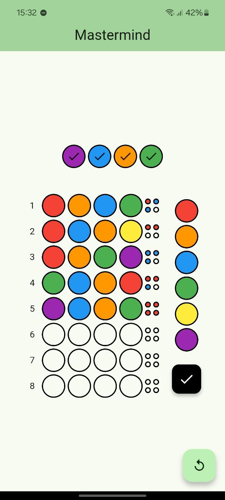

# Mastermind

Mastermind Mobile.
Hai a disposizione 8 tentativi per indovinare una sequenza segreta di 4 colori. Scegli i colori dalla colonna
a destra e premi il pulsante nero con la spunta per verificare la sequenza. I 4 cerchietti a destra dei tentativi sono degli indicatori che
ti guideranno alla vittoria. Una volta premuto il pulsante verifica, essi si riempiranno di rosso in base a quanti
colori hai indovinato e sono nella posizione giusta, mentre di blu se non sono nella posizione giusta.
Finita la partita, puoi iniziarne una nuova premendo sul pulsante verde in basso a destra.




## Scelte di sviluppo

Il codice del progetto è suddiviso in numerose classi in modo da aumentarne la leggibilità.

I colori che comporranno le sequenze tentate vengono scelti dall'utente dall'apposita colonna verticale
di colori a destra. Questo rende l'insieme di colori più facilmente visualizzabile e più rapida la loro selezione.
La logica di funzionamento è gestita dall'apposita classe Controller in modo da separarla al meglio dalle componenti grafiche e dal codice per gestirle.


## Requisiti

- Flutter SDK
- Android Studio

L'ambiente deve essere configurato correttamente, il seguente comando da digitare sul prompt dei comandi fornirà indicazioni sullo stato configurazione:
```bash
flutter doctor
```

## Download del progetto

Questa applicazione funziona per i dispositivi Android.
È possibile scaricare questo progetto selezionando il percorso desiderato dal prompt dei comandi e digitando:
```bash
git clone https://github.com/LeoF-07/Mastermind.git
```

Se i [Requisiti](#Requisiti) sono rispettati sarà possibile modificare il progetto con Android Studio o Visual Studio Code ed emularlo.


## Emulazione dell'applicazione

L'emulazione dell'applicazione può avvenire o con i dispositivi virtuali che Android Studio mette a disposizione oppure su un dispositivi fisico personale. Se si sceglie di eseguire il debug con questa seconda opzione è necessario seguire questi passaggi:
1. Collegare il dispositivo al PC tramite un cavo USB.
2. Assicurarsi che il **debug USB** sia attivo nelle Opzioni sviluppatore del dispositivo Android.
3. Verificare che il dispositivo sia riconosciuto e ottenere l'id del dispositivo con:
```bash
futter devices
```
4. Digitare nel prompt dei comandi all'interno della cartella del progetto:
```bash
flutter run -d <device-id>
```

## Creazione APK

L'APK può essere creato direttamente del Menu di Android Studio nella sezione Build, oppure è sufficiente digitare questo comando nel prompt dei comandi all'interno della cartella del progetto:
```bash
flutter build apk --release
```

Nella sezione [Releases](https://github.com/LeoF-07/Mastermind/releases) della repository è presente l'APK da scaricare senza bisogno di aprire il progetto con un IDE.


Trasferendo l'apk su un dispositivo Android potrà essere scaricato e l'applicazione sarà pronta all'uso.


## Autore
Leonardo Fortin
